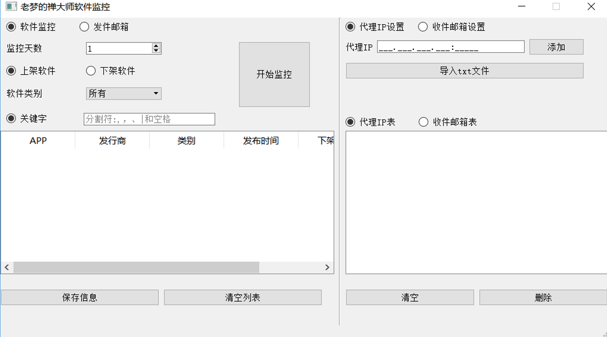

## 参数

- 天数：N。爬取从当前开始，前N天的数据
- 上\下架类型：选择监控的上架还是下架类型
- 应用类别：选择监控的应用类别：所有？应用？游戏？
- 关键词搜索：可以使用多关键词搜索：分割符：，, 空格 |

- ip池：ip代理， 分割符：, 空格？
- 邮箱池：要发送的邮箱地址：按钮加入
- 发件人：邮箱地址+密码

- 信息池：显示各类游戏信息和上/下架时间

# 软件展示

# 操作

## 监控

- 监控天数：从当前起为第一天，往前推算，进行监控
- 上/下架软件：。。。
- 软件类别：监控某一类别的软件信息
- 关键字：可以用分割符输入多个关键字，进行监控
- 监控信息为：app名字, 发行商,发布时间,下架时间, 价格,类别,Apple ID, 链接
- 保存信息：将信息保存为CSV格式的文件

## 代理IP设置

- 往代理IP表中加入代理IP
  - 导入的txt文件数据格式：每一行一个IP：xxx.xxx.xxx.xxx:xxxxx
- 如果代理IP表中没有IP，则`默认为自身IP`

## 邮件设置

- 发件人邮箱：需要开启STMP服务，要到邮箱中开启，并获取授权码
  - 默认的是QQ邮箱，这是个软件缺点。
- 收件人邮箱：只需要将邮箱加入邮箱列表中即可，可以是任意邮箱
  - 导入txt的格式：每行一个邮箱号

## 不足

- 信息表格：爬虫爬取完信息才能将信息放入表格中，如何实时地将信息放入表格中显示呢？使用进程的Queue?

- 进度条没有设置

- 爬虫运行时无法强制停止，只能退出软件

- 失效的IP地址，不会爆出，当所有IP地址全失效才会提示

- 数据暂时只设置存放为文件，且爬取的关键信息还是不够

- 没有定时爬取操作，只能人工启动。

- 界面。。。

## 文件信息

### EXE位置：main文件夹/dist/main.exe

- 只是下载exe,需要把main文件夹全部下载

### 代码文件：

- main.py                  主程序文件
- CDSGui.py             Qt界面设计
- CDSGuiNew.py      继承CDSGui.py文件的界面类，对控件进行主要设计
- spider.py     	        爬虫	
- DateTime.py            时间格式处理
- MailSend.py             邮件操作
- MyThread.py            QThread线程设计
- FileSave.py               文件保存